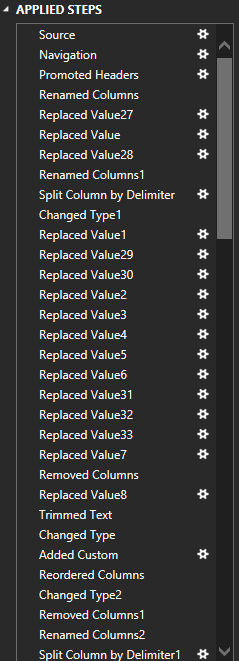
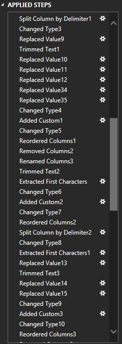
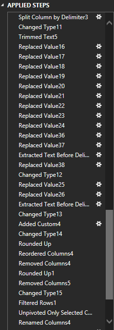
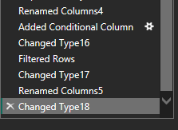
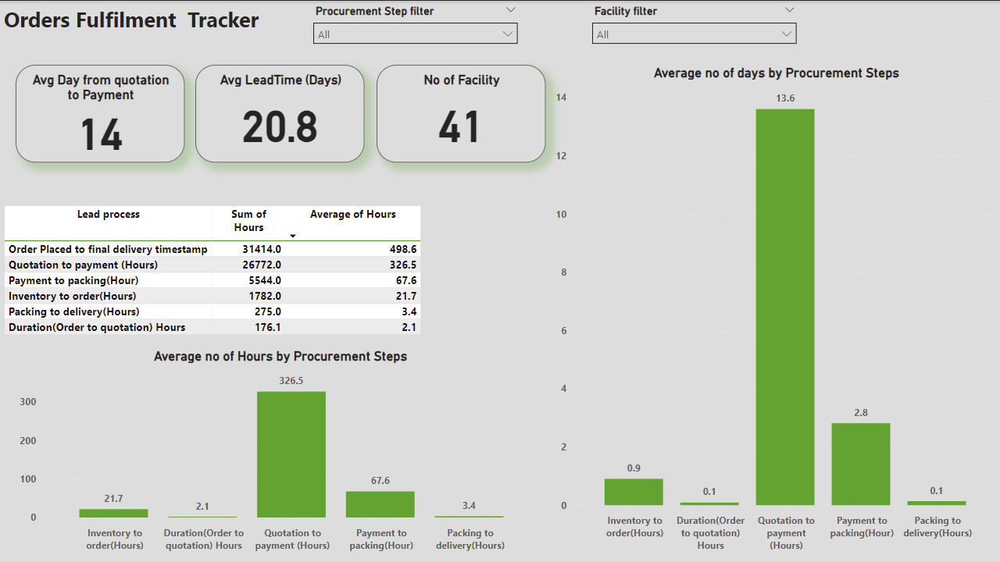

# Diagnostic Analysis 

## Introduction
This project focused on a B2B e-commerce startup, where the goal is to identify and address bottlenecks in the fulfillment process. While the raw data remains confidential, the findings, insights, and recommendations will be shared here. 

_The project demonstrates both the analytical and technical skills required to diagnose and solve business challenges using data, showcasing the power and capabilities of Microsoft Power BI in driving actionable insights_

## Situation
Orders were coming in and deliveries were made, but customers consistently complained about long delivery times, which negatively impacted the business.

## Task:
 Diagnose the fulfillment process to identify the cause of delayed order completion.

## Action:
I received unstructured data from the client and imported it into Power BI. Using Power Query Editor, I transformed the data to analyze the process (with confidentiality maintained as the client did not authorize public sharing).

**_To really show how dirty and unstructured the data set is, these are the applied steps using Power Query Editor_** 

----------------------------|-------------------------------|-------------------------------|-------------------------------|

      |        |       |        |
                            

_**DAX LANGUAGE :**_

- **Average Lead time** `= AVERAGE('Order Tracker (Time Inteligence)'[Hours])`

- **Average Order Placed to final delivery timestamp** `= CALCULATE(AVERAGE('Order Tracker (Time Inteligence)'[Hours]),'Order Tracker (Time Inteligence)'[Lead process] = "Order Placed to final delivery timestamp")`

- **Average Lead Time(Days)** `= DIVIDE([Average Order Placed to final delivery timestamp],24)`

- **Average Quotation to payment (Days)** = 

IF(
   
    ISBLANK(DIVIDE([Average Quotation to payment (Hours)], 24)),
  
    0,
   
    DIVIDE([Average Quotation to payment (Hours)], 24)

)

## Result:
Bottlenecks were identified, and the following insights were gathered:

## Insights
### Key Metrics:
- Average Days from Quotation to Payment: 14 days
- Average Lead Time: 20.8 days
- Facilities Tracked: 41
Lead Time Breakdown:
- Order to Final Delivery: 498.6 hours
- Quotation to Payment: 326.5 hours
- Payment to Packing: 67.6 hours
- Inventory to Order: 21.7 hours
- Packing to Delivery: 3.4 hours
- Order to Quotation Duration: 2.1 hours
## Key Observations:
1.	Lead Time Stagnation: The lead time of 20.8 days remains unchanged, mainly due to delays in:
- Order to Delivery (498.6 hours) and
- Quotation to Payment (326.5 hours).
2.	Minor Delays: Steps like Inventory to Order (21.7 hours) and Payment to Packing (67.6 hours) are relatively efficient

## Recommendations:
- Investigate Delivery Delays: _Review the logistics and vendor timelines to address final delivery delays_.
- Streamline Payment Processes: _Automate approval workflows to shorten the quotation-to-payment cycle_.
- Monitor Real-Time Performance: _Set up alerts for key process steps that exceed threshold times_.
- Review KPIs Regularly: _Continuously adjust workflows based on performance data to drive improvements_.

